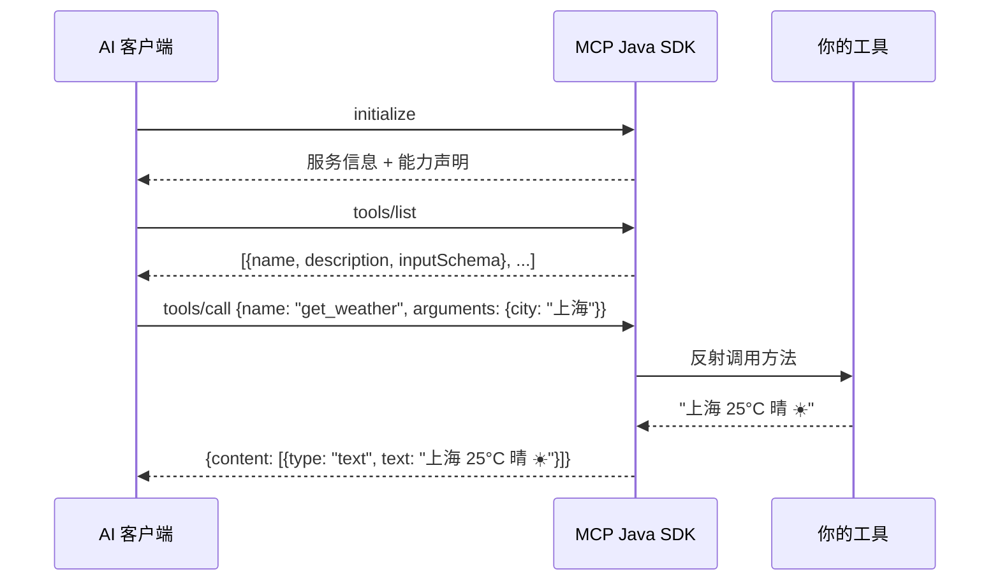

# MCP Java SDK 🐱

[](https://github.com/jianglai-2000/mcp-java/actions/workflows/ci.yml)
[](https://adoptium.net/)
[](LICENSE)

> **让 AI 客户端（Claude Desktop、Cursor 等）直接调用你写的 Java 工具！**

> A lightweight Java SDK for the [Model Context Protocol (MCP)](https://spec.modelcontextprotocol.io) — build servers and expose Java tools to AI clients.

---

## 这是什么？/ What is this?

**中文：**
MCP（Model Context Protocol）是 AI 工具的标准协议——相当于给 AI 插上 USB-C 接口。

你的 Java 工具通过这个 SDK 暴露出来，Claude Desktop 等 AI 客户端就能直接调用。

**English:**
MCP is the standard protocol for AI tool integration — think of it as a USB-C port for AI. This SDK lets you expose your Java tools so MCP-compatible clients (Claude Desktop, Cursor, etc.) can call them directly.

---

## 🚀 快速开始 / Quick Start

### 前提 / Prerequisites

- **Java 21+** (recommended)
- **Maven 3.8+** (or use the included `mvnw` wrapper)

### 1️⃣ 引入依赖 / Add dependency

```xml
<dependency>
    <groupId>io.mcp</groupId>
    <artifactId>mcp-java-server</artifactId>
    <version>0.1.0</version>
</dependency>
```

### 2️⃣ 写工具 / Write your tools

```java
import io.mcp.server.annotation.*;

@McpToolProvider
public class MyTools {

    @McpTool(name = "get_weather", description = "查询城市天气")
    public String getWeather(@McpParam("city") String city) {
        return "上海 25°C 晴 ☀️";
    }

    @McpTool(name = "calculate", description = "计算两个数之和")
    public int add(@McpParam("a") int a, @McpParam("b") int b) {
        return a + b;
    }
}
```

### 3️⃣ 启动 server / Start the server

```java
McpServer.create("my-ai-tools", "1.0.0")
    .registerTools(new MyTools())
    .build()
    .start();
```

或者用 **Maven Wrapper** 打包运行：

```bash
./mvnw clean package -DskipTests
java -jar target/mcp-java-server-0.1.0.jar
```

---

## 🔧 通信流程 / Protocol

### stdio 模式


### SSE/HTTP 模式
```
Client                    Server (mcp-java)
  |                          |
  |--- GET /sse ------------>|  建立 SSE 连接
  |<-- event: endpoint ------|  告诉客户端 POST 地址
  |    data: /message?sid=x  |
  |                          |
  |--- POST /message ------->|  发送 JSON-RPC 请求
  |<-- 202 Accepted ---------|  立即确认
  |<-- event: message -------|  通过 SSE 推送响应
```

---

## 📦 内置 Demo 工具 / Built-in Demo Tools

启动后自带 15 个实用工具，开箱即用：

| 分类 | 工具名 | 功能 |
|------|--------|------|
| 📁 **文件系统** | `read_file` | 读取文件内容 |
| | `write_file` | 写入/覆盖文件 |
| | `list_dir` | 列出目录（带图标和大小） |
| | `file_info` | 文件详情（大小、权限、修改时间） |
| 📝 **文本处理** | `word_count` | 统计字符/单词/行数 |
| | `base64_encode` / `base64_decode` | Base64 编解码 |
| | `url_encode` / `url_decode` | URL 编解码 |
| 💻 **系统信息** | `system_info` | OS、Java、CPU、内存信息 |
| | `env_var` | 查询环境变量 |
| 🛠 **实用工具** | `uuid` | 生成 UUID v4 |
| | `list_timezones` | 列出时区（支持过滤） |
| | `current_time` | 获取指定时区当前时间 |
| | `calculate` | 计算数学表达式 |

---

## 🔌 配置 Claude Desktop

编辑 `claude_desktop_config.json`：

```json
{
  "mcpServers": {
    "my-java-tools": {
      "command": "java",
      "args": ["-jar", "D:/path/to/mcp-java-server-0.1.0.jar"]
    }
  }
}
```

然后你就可以在 Claude 里说："帮我读一下这个文件"、"看看系统有多少内存"。

---

## 🧪 手动测试 / Manual Test

### stdio 模式（默认，适合 Claude Desktop）

```bash
java -jar target/mcp-java-0.1.0.jar
```

另一个终端喂消息测试：

```bash
echo '{"jsonrpc":"2.0","id":1,"method":"initialize","params":{}}' | java -jar target/mcp-java-0.1.0.jar
```

### SSE/HTTP 模式（独立 Web 服务）

```bash
java -jar target/mcp-java-0.1.0.jar --transport sse --port 8080
```

测试：

```bash
curl -X POST http://localhost:8080/message \
  -H "Content-Type: application/json" \
  -d '{"jsonrpc":"2.0","id":1,"method":"initialize","params":{}}'
```

首次使用需要先连接 `/sse` 获取 session，具体见 MCP SSE 协议。

---

## 📋 功能清单 / Features

| Feature | 状态 |
|---------|------|
| JSON-RPC 2.0 消息协议 | ✅ |
| stdio 传输层（stdin/stdout） | ✅ |
| stdin EOF 自动退出 | ✅ |
| SSE/HTTP 传输 | ✅ |
| CORS 支持 | ✅ |
| `@McpTool` / `@McpParam` 注解 | ✅ |
| `@McpToolProvider` 类注解 | ✅ |
| 自动 JSON Schema 生成 | ✅ |
| 线程安全的工具注册中心 | ✅ |
| Logback 日志（输出到 stderr） | ✅ |
| 完整 MCP 握手流程 | ✅ |
| Maven Wrapper (`mvnw`) | ✅ |
| 中英双语文档 | ✅ |
| 单元测试（14 个） | ✅ |
| 集成测试（3 个） | ✅ |
| MCP Resources 支持 | 🔜 |
| MCP Prompts 支持 | 🔜 |
| Spring Boot Starter | 🔜 |
| Maven Central 发布 | 🔜 |

---

## 🤝 参与贡献 / Contributing

PRs welcome! 欢迎提交 Pull Request。

---

## 📄 开源协议 / License

[MIT](LICENSE)

---

> Made with 🐱 by a Java developer who believes code should be useful, not just a job.
